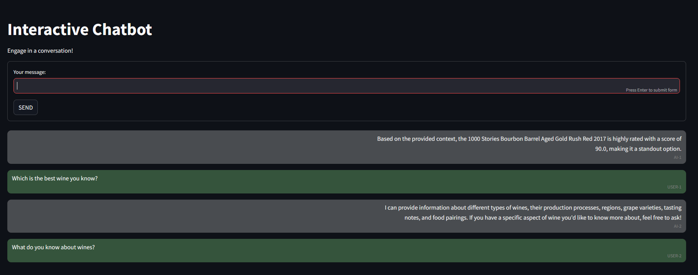

# Retrieval Augmented Generation (RAG) with Azure

This repository contains a Retrieval Augmented Generation application deployed on Azure, using 

- Azure OpenAI Service (chat and embeddings models)
- and Azure AI Search.

The original idea/code is from [alfredodeza/azure-rag](https://github.com/alfredodeza/azure-rag), but I considerably extended/modified that source, e.g.:

- A simple Streamlit-based frontend is included here.
- The backend code is refactored into logical modules: API, RAG functionalities, etc.
- ...

The present repository uses a simple CSV as the unique document known to the chatbot, but it can be easily modified to work with any documents, as long as our Azure tiers allow that.

I apply some of the concepts shown in the course [Operationalizing LLMs on Azure](https://www.coursera.org/learn/llmops-azure), which is the second module of the Coursera Specialization [Large Language Model Operations (LLMOps)](https://www.coursera.org/specializations/large-language-model-operations).

If your are interested in my notes/guide on the course, you can visit [mxagar/generative_ai_udacity/06_RAGs_DeepDive/02_Azure_LLMs](https://github.com/mxagar/generative_ai_udacity/tree/main/06_RAGs_DeepDive/02_Azure_LLMs).



## Table of Contents

- [Retrieval Augmented Generation (RAG) with Azure](#retrieval-augmented-generation-rag-with-azure)
  - [Table of Contents](#table-of-contents)
  - [Repository Structure](#repository-structure)
  - [Setup](#setup)
    - [Environment: Local Development](#environment-local-development)
    - [Infrastructure: Deployment of Azure Services](#infrastructure-deployment-of-azure-services)
    - [General Installation (Docker)](#general-installation-docker)
    - [Data Ingestion](#data-ingestion)
  - [How to Run This](#how-to-run-this)
    - [Running the Backend Locally](#running-the-backend-locally)
    - [Using the Cloud Deployment of the Backend](#using-the-cloud-deployment-of-the-backend)
    - [API](#api)
    - [GUI](#gui)
  - [Notes on Retrieval Augmented Generation](#notes-on-retrieval-augmented-generation)
  - [Improvements](#improvements)
  - [Related Links](#related-links)
  - [Authorship and License](#authorship-and-license)

## Repository Structure

The repository consists of the following files and folders:

```
.
├── README.md                           # This file
├── assets/                             # Images, media
├── data/                               # Documents ingested to be used by the RAG system
│   └── ...
├── backend/                            # The chatbot backend
│   ├── config.yaml                     # Configuration parameters
│   ├── api.py                          # FastAPI endpoint to use the chatbot as an API
│   └── rag.py                          # RAG implementation (using Azure services via LangChain)
├── frontend/
│   └── gui.py                          # Streamlit-based chatbot GUI
├── docker/                             # Dockerfiles
│   └── ...
├── infra/                              # Files and information of the infrastructure deployment (Azure services)
│   └── ...
├── scripts/                            # Bash/CLI scripts to spin up services & Co.
|   └── ...
├── notebooks/
│   ├── azure_search_rag.ipynb          # Tests with Azure-LangChain services used in the RAG
│   ├── ingest_data.ipynb               # Convenience notebook to ingest documents into Azure AI Search
│   └── test_api.ipynb                  # Tests with the FastAPI endpoint of the deployed RAG
├── conda.yaml                          # Basic conda environment definition
├── requirements-dev.in                 # Dependencies for development
├── requirements-dev.txt                # Dependencies after compilation with pip-tools
├── requirements.in                     # Dependencies for deployment (pinned)
├── requirements.txt                    # Dependencies after compilation with pip-tools
...
```

## Setup

The dependencies can be found in [`requirements.in`](./requirements.in) (deployment) and [`requirements-dev.in`](./requirements-dev.in) (development), which are compiled using `pìp-tools`.

### Environment: Local Development

Install a Python environment, e.g., using `conda`:

```bash
# Create environment (Python 3.10, pip & pip-tools)
conda env create -f conda.yaml
# Activate environment
conda activate azure-rag

# Generate pinned dependencies and install/sync
pip-compile requirements.in --verbose  # create requirements.txt
pip-compile requirements-dev.in --verbose  # create requirements-dev.txt > requirements.txt
pip-sync requirements-dev.txt  # install requirements-dev.txt

# If we need a new dependency,
# add it to requirements[-dev].in 
# (WATCH OUT: try to follow alphabetical order)
# And then:
pip-compile requirements[-dev].in
pip-sync requirements[-dev].txt
```

### Infrastructure: Deployment of Azure Services

The chatbot is deployed as an Azure Container App. However, prior to that, several additional services need to be configured and deployed; additionally, we need to get the access keys to those services:

- Azure OpenAI: this service contains two models:
  - `gpt-4o-mini`: the generative LLM used for chatting.
  - `text-embedding-ada-002`: the embeddings model used to vectorize the document chunks, as well as the queries.
- Azure AI Search: this service holds the index and the vector store for the ingested documents.

Once the necessary resources have been created, a Github workflow is manually triggered to build & push the app image(s), and deploy them to Azure.

Check [`infra/README.md`](./infra/README.md) for a detailed explanation.

### General Installation (Docker)

The folder [`docker/`](./docker) contains the necessary image definitions; the Dockerfile headers contain the build and run commands, e.g., in [`Dockerfile.backend`](./docker/Dockerfile.backend):

```bash
# Build the Docker image (use --no-cache if we want to force rebuild)
cd .../azure-rag-app
docker build --no-cache -f docker/Dockerfile.backend --build-arg http_proxy=$env:HTTP_PROXY --build-arg https_proxy=$env:HTTPS_PROXY -t azure-rag-backend .

# Run the container: port-forward to our desktop 8080 port
cd .../azure-rag-app
docker run --rm --env-file .env -p 8080:8000 azure-rag-backend
# Open in browser: http://localhost:8080/docs
```

Note that for running the image containers

- the Azure services need to be up and running (see [Infrastructure: Deployment of Azure Services](#infrastructure-deployment-of-azure-services)),
- all the variables/secrets must be known and set (either in `.env` or in the Github repository settings),
- and the desired documents need to be indexed (see [Data Ingestion](#data-ingestion)).

### Data Ingestion

Data ingestion can be carried out after all the Azure resources have been set up. The convenience notebook [`notebooks/ingest_data.ipynb`](./notebooks/ingest_data.ipynb) shows how to perform it.

## How to Run This

There are several ways to run the RAG application; for all of them, first

- the Azure infrastructure needs to be deployed first, as explained in [Infrastructure: Deployment of Azure Services](#infrastructure-deployment-of-azure-services).
- and the data/documents needs to be ingested, as shown in [`notebooks/ingest_data.ipynb`](./notebooks/ingest_data.ipynb).

Basic usage of the Azure services via the LangChain library is showcased in the notebook [`notebooks/azure_search_rag.ipynb`](./notebooks/azure_search_rag.ipynb).

Once the infrastructure is setup and all the secrets/keys are known, we can:

- launch the docker container of the backend locally
- or deploy the docker container of the backend on Azure as a Container App.

Then, we can use the RAG backend

- via its API
- or via the GUI or frontend (which uses the backend API).

The following subsections give details for all those operation modi.

### Running the Backend Locally

Assuming the Azure resources have been launched successfully and the documents have been ingested, we can build the backend image and run it locally:

```bash
# Start backend, e.g., locally
cd .../azure-rag-app
docker run --rm --env-file .env -p 8080:8000 azure-rag-backend    
# Open browser and go to http://localhost:8080/docs
```

This local backend serves the RAG API in [http://localhost:8080](http://localhost:8080), with the endpoints defined in [`backend/api.py`](./backend/api.py). We can check the swagger and try the endpoints

### Using the Cloud Deployment of the Backend

The Github workflow in [`.github/workflows/main.yml`](.github/workflows/main.yml)

- builds the backend container, 
- pushes it to the Github container registry 
- and deploys it to the already setup Azure Container App.

To carry out this cloud deployment, all the secrets and variables need to be correctly set in the Github repository settings.

See [`infra/README.md`](./infra/README.md) for more details.

Once the deployment is carried out, the backend API should be accessible in the URL associated to the Container App.

### API

The notebook [`notebooks/test_api.ipynb`](./notebooks/test_api.ipynb) shows how to use the backend API, both the local and the cloud deployment.

### GUI

The GUI can be run locally as follows:

```bash
# Start GUI, e.g. locally
cd .../azure-rag-app
streamlit run frontend/gui.py
# Browser should be opened automatically
# Ctrl+C to stop the Streamlit server first, then close browser
```

## Notes on Retrieval Augmented Generation

TBD.

## Improvements

- [x] Use Terraform IaC to deploy Azure resources
- [ ] Try Document Intelligence for document parsing
- [ ] Try query transformation techniques
  - Rewrite to be a more general question
  - Rewrite to be a more concrete question
  - Generate different perspectives of the query, i.e., multiple queries
- [ ] Try multi-resolution indexing
- [ ] Use different indexing/storage databases
  - Try LLM-guided retrieval routing
  - Combine retrieved documents by re-ranking them or by applying reciprocal rank fusion
- [ ] Try agentic/self-reflective approaches, i.e., let an LLM assess the value of the output and improve answer if necessary

For ideas about techniques to improve a vanilla RAG, check: [mxagar/RAG_from_Scratch](https://github.com/mxagar/generative_ai_udacity/tree/main/06_RAGs_DeepDive/01_RAG_from_Scratch).


## Related Links

- My notes on the LangChain tutorial [RAG from Scratch by Langchain (Youtube & Freecodecamp)](https://www.youtube.com/watch?v=sVcwVQRHIc8): [mxagar/generative_ai_udacity/06_RAGs_DeepDive/01_RAG_from_Scratch](https://github.com/mxagar/generative_ai_udacity/tree/main/06_RAGs_DeepDive/01_RAG_from_Scratch).
- My notes on the Coursera course [Operationalizing LLMs on Azure](https://www.coursera.org/learn/llmops-azure): [mxagar/generative_ai_udacity/06_RAGs_DeepDive/02_Azure_LLMs](https://github.com/mxagar/generative_ai_udacity/tree/main/06_RAGs_DeepDive/02_Azure_LLMs).
- My personal notes on the [Udacity Generative AI Nanodegree](https://www.udacity.com/course/generative-ai--nd608): [mxagar/generative_ai_udacity](https://github.com/mxagar/generative_ai_udacity).
- My guide on Azure: [mxagar/azure_guide](https://github.com/mxagar/azure_guide).
- My personal notes on the O'Reilly book [Generative Deep Learning, 2nd Edition, by David Foster](https://github.com/mxagar/generative_ai_book)
- My personal notes on the O'Reilly book [Natural Language Processing with Transformers, by Lewis Tunstall, Leandro von Werra and Thomas Wolf (O'Reilly)](https://github.com/mxagar/nlp_with_transformers_nbs)
- [HuggingFace Guide: `mxagar/tool_guides/hugging_face`](https://github.com/mxagar/tool_guides/tree/master/hugging_face)
- [LangChain Guide: `mxagar/tool_guides/langchain`](https://github.com/mxagar/tool_guides/tree/master/langchain)
- [LLM Tools: `mxagar/tool_guides/llms`](https://github.com/mxagar/tool_guides/tree/master/llms)
- [NLP Guide: `mxagar/nlp_guide`](https://github.com/mxagar/nlp_guide)
- [Deep Learning Methods for CV and NLP: `mxagar/computer_vision_udacity/CVND_Advanced_CV_and_DL.md`](https://github.com/mxagar/computer_vision_udacity/blob/main/03_Advanced_CV_and_DL/CVND_Advanced_CV_and_DL.md)
- [Deep Learning Methods for NLP: `mxagar/deep_learning_udacity/DLND_RNNs.md`](https://github.com/mxagar/deep_learning_udacity/blob/main/04_RNN/DLND_RNNs.md)


## Authorship and License

As mentioned, the original idea/code, although considerably changed, stems from [alfredodeza/azure-rag](https://github.com/alfredodeza/azure-rag).

For more information, see [`LICENSE`](./LICENSE).

Mikel Sagardia, 2025.  
No guarantees.
