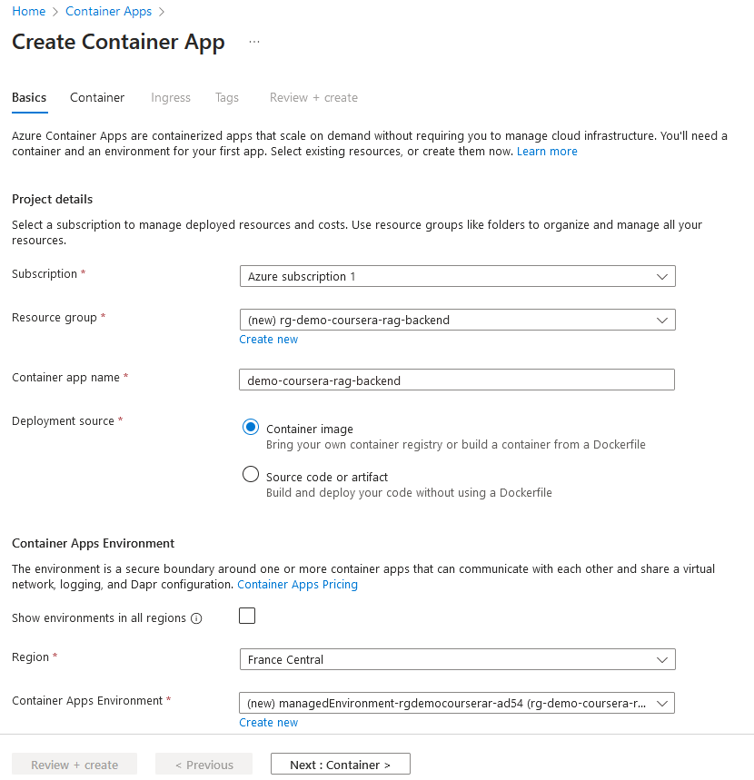
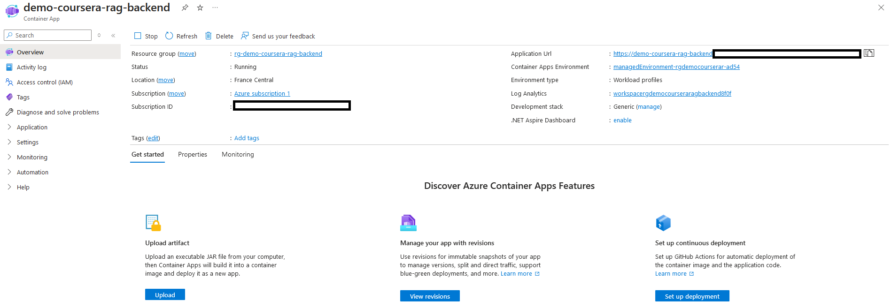
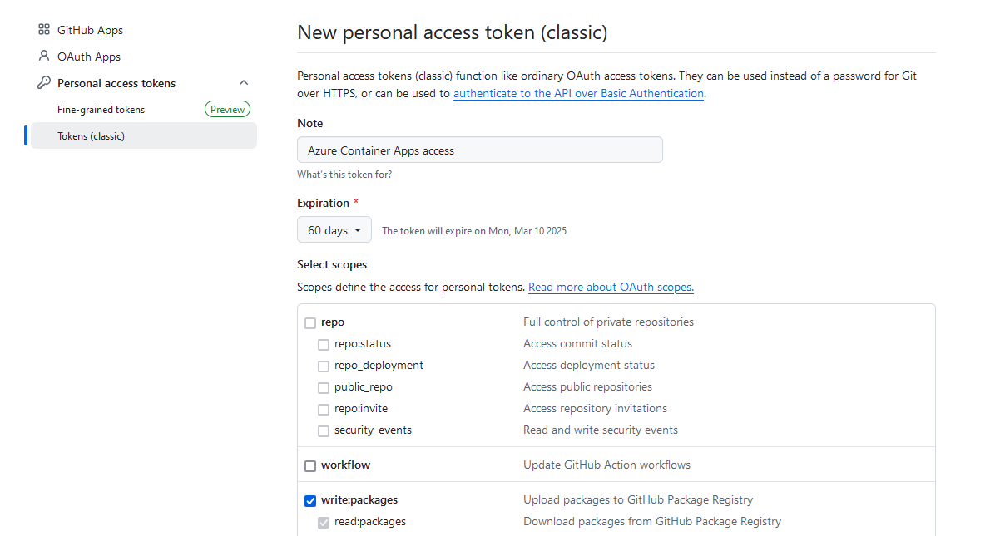
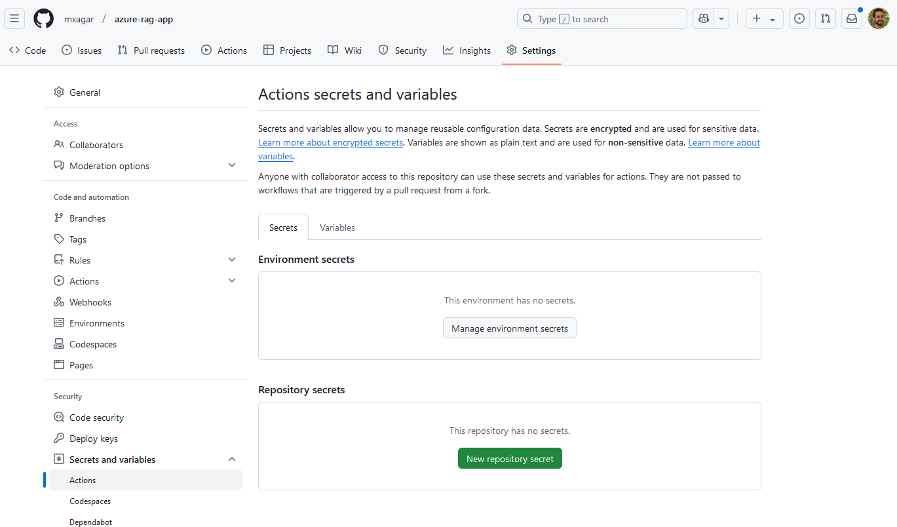

# Infrastructure

In order to deploy our application backend, we need to first provision the Azure services we are going to use; these are:

- Azure AI Search
- Azure OpenAI
- Azure Container App

We can do that

- "manually" using the Azure Portal UI
- or programmatically, e.g., via Terraform IaC.

In both cases, we need a Docker image registry; I have used Github.

This document is a detailed manual of how to approach both cases without much experience; it is intended to be read from beginning to end, whereby advanced users can skip some parts.

## Table of Contents

- [Infrastructure](#infrastructure)
  - [Table of Contents](#table-of-contents)
  - [Manual Provisioning via Azure Portal](#manual-provisioning-via-azure-portal)
    - [Azure OpenAI](#azure-openai)
    - [Azure AI Search](#azure-ai-search)
    - [Azure Container App](#azure-container-app)
    - [Azure Credentials: Service Principal](#azure-credentials-service-principal)
    - [Github Personal Access Token](#github-personal-access-token)
    - [Create a Backend Access Secret](#create-a-backend-access-secret)
    - [Summary of Variables and Secrets](#summary-of-variables-and-secrets)
    - [Github Actions Workflow Overview](#github-actions-workflow-overview)
      - [Triggering the Deployment](#triggering-the-deployment)
      - [Issues and Tips](#issues-and-tips)
    - [FastAPI](#fastapi)
  - [IaC Provisioning with Terraform](#iac-provisioning-with-terraform)
    - [Initial Setup](#initial-setup)
    - [Configuration Files](#configuration-files)
    - [Resource Names](#resource-names)
    - [Provisioning All Resources](#provisioning-all-resources)
    - [Steps to Carry Out After the Provisioning of the Azure Resources](#steps-to-carry-out-after-the-provisioning-of-the-azure-resources)
    - [Possible Issues and Tips](#possible-issues-and-tips)
    - [Summary of Secrets and Variables: Contents in `.env` and Github Settings](#summary-of-secrets-and-variables-contents-in-env-and-github-settings)


## Manual Provisioning via Azure Portal

In this section, the manual provisioning of the infrastructure is explained.

We need to [create an Azure account](https://azure.microsoft.com/en-us/pricing/purchase-options/azure-account) and open the [Azure Portal](https://portal.azure.com)

First, we need to provision these resources:

- A Resource group, which will contain all the other services.
- An Azure AI Search service (accessible from everywhere):
  - It will contain and index.
  - We need to fill in the index programmatically, as shown in the previous section.
- An Azure OpenAI service (accessible from everywhere)
  - Chat model, e.g., `gpt-4o-mini`
  - Embeddings model, e.g., `text-embedding-ada-002`
- An Azure Container App: it will run a container or our app, i.e., it will be the backed API of our chatbot.

Then, the deployment deployment of the backend occurs following these steps:

1. We create a Service Principal bot account on Azure.
2. We create a Github Personal Access Token (PAT).
3. Our code is pushed to Github and we go to the Github Actions section to run our workflow.
4. Github Actions packages the code into an image (using `Dockerfile.backend`). 
5. The built container is pushed to the Github Container Registry.
6. Github Actions triggers the pulling of the Container onto the Azure Container App.

Even though we have deployed one container, Azure takes care of the scaling automatically performing horizontal scaling: if more users request/use the app, more replicas are deployed.

### Azure OpenAI

Summary of steps:

- In the [Azure Portal](https://portal.azure.com), find the Azure OpenAI service and create one
  - You can select the RG and location you want, but I would select a unique RG for all services.
- After the resource is deployed, we open it and then click on `Overview: Explore Azure AI Foundry`.
- In the Azure AI Foundry, in the `Deployments` section, we can deploy two models:
  - Chat model, e.g., `gpt-4o-mini`
  - Embeddings model, e.g., `text-embedding-ada-002`
- We can configure the model parameters if desired:
  - Tokens per minute
  - Dynamic quota
  - etc.
- Once a model is deployed, we can test it in the `Chat: Playground` section.
- The `Overview` tab in the resource contains the URL/endpoint and the key(s): `Resource Management > Keys and Endpoints`.


### Azure AI Search

Summary of steps to provision Azure AI Search:

- In the [Azure Portal](https://portal.azure.com), find the Azure AI Search service and create one
  - You can select the RG and location you want, but I would select a unique RG for all services.
- After the resource is deployed, we open it and can browse it:
  - The `Overview` section contains the URL/endpoint.
  - In `Search management > Indexes` will appear our our indexes when we ingest the data.
  - The `Settings` tab in the resource contains the key(s): `Keys`.


### Azure Container App

To deploy the app in [mxagar/azure-rag-app](https://github.com/mxagar/azure-rag-app) we need to deploy an [Azure Container App](https://azure.microsoft.com/en-us/products/container-apps); another option would have been an [Azure Web App or App Service](https://azure.microsoft.com/en-us/products/app-service/web). Check this link:

[Azure App Service vs Azure Container Apps - which to use?](https://learn.microsoft.com/en-us/answers/questions/1337789/azure-app-service-vs-azure-container-apps-which-to); TLDR; both are scalable and very similar, but Azure Container Apps seem to offer more control on the container image we want to use and the overall configuration.

<!-- HERE! -->

    Azure Portal: Search Container App > Create
      Subscription: Azure subscription 1
      Resource group: pick the same as for the rest of resources
      Container app name: ...
        We need this name later!
      Deployment source: Container image
      Region: France Central or the one you prefer
    Container: we can select the Quickstart image for now: 
      Simple hello world container
      This will be changes later



We can select the Quickstart image in the beginning (Simple hello world container); alternatively, if we already have pushed our image to a registry, we can define it in the Container tab. Once deployed, if we go to our resource, we see it has an URL we can visit.



Interesting links:

- [Quickstart: Build and deploy from local source code to Azure Container Apps](https://learn.microsoft.com/en-us/azure/container-apps/quickstart-code-to-cloud?tabs=bash%2Cpython)
- [Azure Container Apps samples](https://learn.microsoft.com/en-us/azure/container-apps/samples)

### Azure Credentials: Service Principal

To set the Azure credentials, we need a **Service Principal** in Azure. A Service Principal in Azure is a security identity used by applications, services, or automation tools to access specific Azure resources. It operates like a user identity but is specifically designed for non-human interactions, such as running applications, scripts, or CI/CD pipelines securely.

To create a Service Principal:

1. We need to install [Azure CLI](https://learn.microsoft.com/en-us/cli/azure/install-azure-cli-windows?tabs=azure-cli).
2. We need to log in using the Azure CLI; when we run the command, a web browser will open to log in; then, we will get back a JSON which conatins information about our subscriptions.
```bash
az login
```
3. We need the [Azure subscription ID](https://portal.azure.com/#view/Microsoft_Azure_Billing/SubscriptionsBladeV2) associated with our resources: `AZURE_SUBSCRIPTION_ID`; if problems, [check this guide](https://docs.microsoft.com/en-us/azure/azure-portal/get-subscription-tenant-id).
4. We need to create a Service Principal with the following details: the AppID, password, and tenant information. Set the proper role access using the following command, and save the output JSON, to be set in Github as the value of `AZURE_CREDENTIALS`:
```bash
az ad sp create-for-rbac --name "CICD" --role contributor --scopes /subscriptions/$AZURE_SUBSCRIPTION_ID --sdk-auth
``` 

I saved in the uncommitted/ignored `.azure_credentials` all the output from both commands.

### Github Personal Access Token

The access token will need to be added as an Action secret.
It is needed because Azure will need to authenticate against the GitHub Container Registry to pull the image.

- [Create one Gihub Personal Access Token (PAT)](https://github.com/settings/tokens/new?description=Azure+Container+Apps+access&scopes=write:packages) with enough permissions to write to packages. Manual access in Github web UI: `Profile > Developer settings (left menu) > Personal access tokens > Tokens (classic)`. Use scope: `write:packages`.
- Save it in `.env` for now as `GH_PAT`.



### Create a Backend Access Secret

Since our backend API will be exposed to the Internet, it makes sense to define a secret only known to it (set during the deployment) which will be requested to use the API.

The notebook [`notebooks/utils.ipynb`](../notebooks/utils.ipynb) shows how to generate one such secret, which can be saved for now in `.env` as `RAG_API_KEY`:

```python
import secrets

# Generate a secure API key
api_key = secrets.token_urlsafe(32)  # 32 bytes (default length)
# We save the resulting API key in .env as RAG_API_KEY
```

### Summary of Variables and Secrets

Now, we can insert all the variable and secret values into our Github repository, i.e., [mxagar/azure-rag-app](https://github.com/mxagar/azure-rag-app):

- We can either define the variables in the Github workflow YAML or also in Github Web UI: Repo > Settings > Secrets and variables: `Actions > Repository variables`.
  - Then, they are accessible in the YAML as `${{ env.VARIABLE_NAME }}`
- BUT: The secrets need to be entered in the Github Web UI: `Repo > Settings > Secrets and variables: Actions > Repository secrets`.
  - Then, they are accessible in the YAML as `${{ secrets.VARIABLE_NAME }}`.



The values must have been collected so far, and they are referenced in the workflow `.github/workflows/main.yaml`:

<!--
| Variable | Type | From | Description | (Example) Value |
|---|---|---|---|---|
| A | secret/variable | Azure/Github | Bla | xxx |

-->

```bash
# Azure OpenAI
AZURE_OPENAI_ENDPOINT_URI=xxx # Long URL, Get from Azure
AZURE_OPENAI_ENDPOINT=xxx # Short URL, Get from Azure
AZURE_OPENAI_API_VERSION=xxx # Get from Azure
DEPLOYMENT_NAME=xxx # Set and get from Azure
CHAT_DEPLOYMENT_NAME=xxx # Set and get from Azure
EMBEDDING_DEPLOYMENT_NAME=xxx # Set and get from Azure
# Azure AI Search
AZURE_SEARCH_ENDPOINT=xxx # Get from Azure
AZURE_SEARCH_INDEX_NAME=xxx # Set and get from Azure
# Azure Container App
AZURE_CONTAINER_APP_NAME=xxx # Set and get from Azure
AZURE_CONTAINER_RG_NAME=xxx # Set and get from Azure
RAG_API_URL=xxx # Get from Azure: The Container App endpoint


# -- SECRETS --
AZURE_SUBSCRIPTION_ID=xxx # Get from Azure
AZURE_OPENAI_API_KEY=xxx # Get from Azure
AZURE_SEARCH_API_KEY=xxx # Get from Azure
GH_PAT=xxx # Get from Github
RAG_API_KEY=xxx # Set using secrets.token_urlsafe(32)

```

### Github Actions Workflow Overview

The Container App will have running the container of the app defined in [mxagar/azure-rag-app](https://github.com/mxagar/azure-rag-app); that app will be packaged into an image which will be stored in the Github Container Registry, as a package. All that happens in the Github Actions Workflow `.github/workflows/main.yaml` from the app repository. Note that we could also use another registry, though, e.g., an Azure registry.

Some important points to consider in `.github/workflows/main.yaml`:

- `AZURE_CONTAINER_APP_NAME`, `AZURE_CONTAINER_RG_NAME`: These are the names related to the deployed Container App.
  - We can either define the variables in the YAML or also in Github Web UI: `Repo > Settings > Secrets and variables: Actions > Repository variables`.
    - Then, they are accessible in the YAML as `${{ env.VARIABLE_NAME }}`
  - BUT: The secrets need to be entered in the Github Web UI: `Repo > Settings > Secrets and variables: Actions > Repository secrets`.
    - Then, they are accessible in the YAML as `${{ secrets.VARIABLE_NAME }}`.
- `on: workflow_dispatch`: This allows to trigger the workflow manually.
- We have two `jobs`: `build` and `deploy`:
  - `jobs: build`: This is the job of the workflow that builds the container:
    - It uses pre-defined actions to checkout the branch, setup build, log in to the container registry, and build and push.
    - Some secrets/variables are automatic: `github.actor`, etc.
  - `jobs: deploy`: This is the job of the workflow that deploys the container:
    - Here, we log in to Azure and then the `az-cli` commands for deployment are executed.
    - Some secrets/variables need to be set in the Github Web UI, e.g.: `secrets.AZURE_CREDENTIALS`.

The values of the variables and the secrets are defined and collected in different steps.
See [Setting the Variables and Secrets of the Github Action/Workflow](#setting-the-variables-and-secrets-of-the-github-actionworkflow) below.

Contents in `.github/workflows/main.yaml`:

```yaml
name: RAG Backend - Build and deploy container

#env:
#  AZURE_CONTAINER_APP_NAME: <app-container-name>
#  AZURE_CONTAINER_RG_NAME: <app-container-rg-name>

# When this action will be executed
on:
  # Automatically trigger it when detected changes in repo. Remove comments to enable
  #push:
  #  branches:
  #    [ main ]

  # Allow mannually trigger
  workflow_dispatch:

jobs:
  build:
    runs-on: ubuntu-latest

    steps:
      - name: Checkout to the branch
        uses: actions/checkout@v2

      - name: Set up Docker Buildx
        uses: docker/setup-buildx-action@v1

      - name: Log in to GitHub container registry
        uses: docker/login-action@v1.10.0
        with:
          registry: ghcr.io
          username: ${{ github.actor }}
          password: ${{ secrets.GH_PAT }}

      - name: Lowercase the repo name and username
        run: echo "REPO=${GITHUB_REPOSITORY,,}" >>${GITHUB_ENV}

      - name: Build and push container image to registry
        uses: docker/build-push-action@v2
        with:
          context: .
          push: true
          tags: ghcr.io/${{ env.REPO }}-backend:${{ github.sha }}
          file: ./docker/Dockerfile.backend

  deploy:
    runs-on: ubuntu-latest
    needs: build

    steps:
      - name: Azure Login
        uses: azure/login@v1
        with:
          creds: ${{ secrets.AZURE_CREDENTIALS }}

      - name: Lowercase the repo name and username
        run: echo "REPO=${GITHUB_REPOSITORY,,}" >>${GITHUB_ENV}

      - name: Deploy to containerapp
        uses: azure/CLI@v1
        with:
          inlineScript: |
            az config set extension.use_dynamic_install=yes_without_prompt
            az containerapp registry set -n ${{ vars.AZURE_CONTAINER_APP_NAME }} -g ${{ vars.AZURE_CONTAINER_RG_NAME }} --server ghcr.io --username  ${{ github.actor }} --password ${{ secrets.GH_PAT }}
            az containerapp update \
              -n ${{ vars.AZURE_CONTAINER_APP_NAME }} \
              -g ${{ vars.AZURE_CONTAINER_RG_NAME }} \
              --set-env-vars \
              OPENAI_API_TYPE=azure \
              AZURE_OPENAI_ENDPOINT=${{ vars.AZURE_OPENAI_ENDPOINT }} \
              AZURE_OPENAI_ENDPOINT_URI=${{ vars.AZURE_OPENAI_ENDPOINT_URI }} \
              AZURE_OPENAI_API_KEY=${{ secrets.AZURE_OPENAI_API_KEY }} \
              AZURE_OPENAI_API_VERSION=${{ vars.AZURE_OPENAI_API_VERSION }} \
              AZURE_SEARCH_ENDPOINT=${{ vars.AZURE_SEARCH_ENDPOINT }} \
              AZURE_SEARCH_API_KEY=${{ secrets.AZURE_SEARCH_API_KEY }} \
              AZURE_SEARCH_INDEX_NAME=${{ vars.AZURE_SEARCH_INDEX_NAME }} \
              RAG_API_KEY=${{ secrets.RAG_API_KEY }} \
              --image ghcr.io/${{ env.REPO }}-backend:${{ github.sha }} \
              --container-name ${{ vars.AZURE_CONTAINER_APP_NAME }}
            az containerapp update -n ${{ vars.AZURE_CONTAINER_APP_NAME }} -g ${{ vars.AZURE_CONTAINER_RG_NAME }} --image ghcr.io/${{ env.REPO }}-backend:${{ github.sha }} --container-name ${{ vars.AZURE_CONTAINER_APP_NAME }}
            az containerapp update -n ${{ vars.AZURE_CONTAINER_APP_NAME }} -g ${{ vars.AZURE_CONTAINER_RG_NAME }} --cpu 1 --memory 2Gi --image ghcr.io/${{ env.REPO }}-backend:${{ github.sha }} --container-name ${{ vars.AZURE_CONTAINER_APP_NAME }}

```

#### Triggering the Deployment

Since we have defined the action/workflow to be triggered manually (`on: workflow_dispatch:`), we need to open the Github web UI and run it manually:

    Github repository > Actions: Select our Workflow > Run Workflow

When the workflow runs successfully, we should see two jobs in green: `build` and `deploy`.


#### Issues and Tips

- Workflows very rarely run green the first time; at least for me ;)
- We can check the logs of each job if we click inside.
- We can also contrast the Azure Container App logs in the Azure Portal: `Container App > Monitoring > Log Stream` or using the `az` CLI:
  ```bash
  az containerapp logs  show  --name $CONTAINER_APP_NAME --resource-group $RESOURCE_GROUP_NAME --follow
  ```
- Sometimes, restarting the Container App (stop and start in the Azure Portal or via the `az` CLI) has been helpful for me. 

### FastAPI

Once the Azure Container App is deployed, we get the Container App URL from the Azure Portal. If we open that URL, it should redirect us to the `/docs` page which contains the API swagger created automatically by FastAPI.


Note that if we have set the `RAG_API_KEY` secret we will need to authenticate in the web UI of the swagger using that secret.

Then, as in any regular FastAPI application, we can try the endpoints manually in the web UI.

## IaC Provisioning with Terraform

<!--HERE-->

Provisioning cloud services via web UI is less than optimal, because it's tedious and non-reproducible.

To the rescue comes Terraform, which enables **Infrastructure as Code (IaC)**.

This section is a primer on Terraform and shows how to apply it to our RAG project.

Always check the [Terraform Azure Reference](https://registry.terraform.io/providers/hashicorp/azurerm/latest/docs) in case something changes in the APIs.

:warning: If some parts are unclear, maybe checking the associated section in the manual process helps.

### Initial Setup

First:

- [Install Terraform](https://developer.hashicorp.com/terraform/tutorials/azure-get-started/install-cli)
- [Install Azure CLI](https://learn.microsoft.com/en-us/cli/azure/install-azure-cli)
- [Create an Azure account](https://azure.microsoft.com/en-us/pricing/purchase-options/azure-account)

Then, we can verify our installations on the terminal:

```bash
# Verify Terraform Installation
terraform -help

# Log in to Azure: Available subscriptions should be returned
az login
```

Create a **Service Principal** account, i.e., a robot account which will be used for programmatic deployments:

```bash
# Get subscription id: AZURE_SUBSCRIPTION_ID
az account show --query "id" -o tsv

# Create Service Principal account: replace AZURE_SUBSCRIPTION_ID
# The output contains (save them): appId (Client ID), password (Client Secret), tenant (Tenant ID)
az ad sp create-for-rbac --name "CICD" --role "Contributor" --scopes /subscriptions/$AZURE_SUBSCRIPTION_ID --sdk-auth
```

Save the Azure secrets and variables in `terraform.tfvars`:

```typescript
client_id       = "your-client-id"
client_secret   = "your-client-secret"
subscription_id = "your-subscription-id"
tenant_id       = "your-tenant-id"
```

We add `terraform.tfvars` to `.gitignore`, because we want to avoid exposing our credentials; thus, usually a `terraform.tfvars.example` is created (with dummy content) to show other developers how they need to set one.

Then, we need to create a `main.tf` where the resources will be defined; for now, we can point to the variables/secrets we have defined in `terraform.tfvars`:

```typescript
provider "azurerm" {
  features {}

  client_id       = var.client_id
  client_secret   = var.client_secret
  subscription_id = var.subscription_id
  tenant_id       = var.tenant_id
}
```

Check that the account can be reached:

```bash
cd .../infra
terraform init
```

### Configuration Files

Now, we create a `variables.tf` file; the goal of the files we have created so far is the following:

- `main.tf`: it defines the `resources`, and uses the `variables` and their values defined in other files.
- `variables.tf`: it defines the `variables` and gives them a default value.
- `terraform.tfvars`: it contains the variable values, not published!

Note that all files are automatically discovered by `terraform`, so we don't need to import one to the other to reference the variables defined elsewhere.

Here's a snippet in `variables.tf`:

```typescript
//...

variable "resource_group_name" {
  description = "The name of the resource group"
  type        = string
  default     = "rg-default"
}
```

Here's a snippet in `terraform.tfvars`:

```typescript
// ...

resource_group_name = "rg-rag-app-demo"
resource_group_location = "West Europe"
```

Here's a snippet in `main.tf`:

```typescript
//...

resource "azurerm_resource_group" "main" {
  name     = var.resource_group_name
  location = var.resource_group_location
}
```

### Resource Names

Note that `resources` are defined as follows:

```typescript
resource "<RESOURCE_TYPE>" "<LOGICAL_NAME>" {
  # Configuration
}
```

Typical `<RESOURCE_TYPE>` values are:

- `azurerm_resource_group`: An Azure resource group.
- `azurerm_virtual_network`: An Azure virtual network.
- `aws_s3_bucket`: An S3 bucket in AWS.
- ...

The `<LOGICAL_NAME>` is a unique name used to refer to the resource within the configuration. It is arbitrary but should describe the resource’s purpose clearly. Example names:

- `"main"`: A simple and common default.
- `"networking"`: For a resource group related to networking.
- `"production"`: For a production resource group.

To reference the resources elsewhere:

```typescript
value = azurerm_resource_group.main.name
```

Also, note that sometimes resource names need to be unique globally.
To that end, it is a common practice to append an alphanumeric suffix to any resource name, obtained by hashing constant values for each app, e.g., the subscription id and the RG location.
This is accomplished in `main.tf`:

```typescript
//...

locals {
  // Concatenate static/constant values to create a unique input for hashing.
  // We create a unique string for our deployment.
  hash_input = join("-", [var.subscription_id, var.resource_group_name, var.resource_group_location])
}

//...

// We append to the var.openai_name the first 6 characters of the local.hash_input.
resource "azurerm_cognitive_account" "openai" {
  name                = "${var.openai_name}-${substr(md5(local.hash_input), 0, 6)}"
  location            = azurerm_resource_group.main.location
  resource_group_name = azurerm_resource_group.main.name
  kind                = "OpenAI"
  sku_name            = "S0" # Standard Tier
}
```

### Provisioning All Resources

The following resources are defined in `main.tf`, all associated to the resource group (RG) `azurerm_resource_group.main.name`, and using the variables defined in `variables.tf` and `terraform.tfvars`:

- Azure OpenAI; later, we will use the models `gpt-4o-mini` and `text-embedding-ada-002`
  - Tier: Standard
  - Location West Europe (or select a desired one)
  - Name: open-ai-demo (or select a desired one)
- Azure AI Search
  - Tier: Free
  - Location: West Europe (or select a desired one)
  - Name: ai-search-demo (or select a desired one)
- Azure Container App
  - Location: West Europe (or select a desired one)
  - Name: backend-container-demo (or select a desired one)
  - When a Container App is deployed via the Web UI, some additional services are created automatically, like an app environment and log analytics; in Terraform, we need to create them explicitly. We define only the environment.
    - Environment name: backend-container-env-demo (or select a desired one)
  - Note: the container image will be set later per `az` CLI command; if one must be chosen, pick a simple Hello World image, as done in `main.tf`.

Check the resulting files with all the definitions:

- [`main.tf`](main.tf): definition of all the resources and their properties.
- [`variables.tf`](variables.tf): definition of variables with names, types and default values to be changed.
- [`terraform.tfvars`](terraform.tfvars) or [`terraform.tfvars.example`](terraform.tfvars.example): explicit variable values.

To carry out the deployment:

```bash
cd .../infra

# Initialize working directory and download required plugins
terraform init

# Check syntax and configuration errors
terraform validate

# Review the changes Terraform will make without actually applying them
# This will create a file named tfplan that you can use to apply changes later
terraform plan -out=tfplan

# Deploy plan
terraform apply tfplan
# If we haven't saved the plan tfplan, we can directly apply
terraform apply
# Once the deployment is complete, Terraform will automatically display the outputs

# View outputs
terraform output
# Access sensitive outputs by outputing a pipeable JSON format
terraform output -json
```

For each deployed resource, we need to pick/output the important secrets and variables, and put them into `.env`.  
:warning: Note: a **better practice would be to deploy a Key Vault and save them there!**.

### Steps to Carry Out After the Provisioning of the Azure Resources

Once the Azure resources have been deployed, we need to perform some manual steps:

- Open the Azure OpenAI service and deploy 2 models manually:
  - Chat model, e.g., `gpt-4o-mini`
  - Embeddings model, e.g., `text-embedding-ada-002`
- Pick all the missing variable/secrets into `.env`.
- Index some documents: [`notebooks/ingest_data.ipynb`](../notebooks/ingest_data.ipynb).
- Set the ingress target port of the Container App to `8000`, if not done yet (the `main.tf` should do it, but check it, just in case): `Container App > Settings > Ingress`.
- Activate the `content_vector` in the index of Azure AI Search so that vectors are shown to the user: `Azure AI Search > Indexes > Index > Fields, ..., Save`.

Then, we need to deploy the backend application to the Container App.
That happens by triggering the Github Action workflow.
But, prior to that:

- We need to create a Github Personal Access Token: `GH_PAT`.
- We need to create a `RAG_API_KEY`, i.e., a password known to the backend which is requested whenever we want to use it. 
- We need to set all these variables in Github.

### Possible Issues and Tips

- The deployment of our image to the Container App sometimes doesn't work right away. Restarting the Container App (stop and start in the Azure Portal or via the `az` CLI) has been helpful for me. 
- We can check the logs of the Container App in the Azure Portal: `Container App > Monitoring > Log Stream` or using the `az` CLI:
  ```bash
  az containerapp logs  show  --name $CONTAINER_APP_NAME --resource-group $RESOURCE_GROUP_NAME --follow
  ```

### Summary of Secrets and Variables: Contents in `.env` and Github Settings

In the following, a example `.env` is shown.

A **better practice would be to deploy a Key Vault and save them there!**.

```bash
# Azure OpenAI
AZURE_OPENAI_ENDPOINT_URI=xxx # Long URL, Get from Azure
AZURE_OPENAI_ENDPOINT=xxx # Short URL, Get from Azure
AZURE_OPENAI_API_VERSION=xxx # Get from Azure
DEPLOYMENT_NAME=xxx # Set and get from Azure
CHAT_DEPLOYMENT_NAME=xxx # Set and get from Azure
EMBEDDING_DEPLOYMENT_NAME=xxx # Set and get from Azure
# Azure AI Search
AZURE_SEARCH_ENDPOINT=xxx # Get from Azure
AZURE_SEARCH_INDEX_NAME=xxx # Set and get from Azure
# Azure Container App
AZURE_CONTAINER_APP_NAME=xxx # Set and get from Azure
AZURE_CONTAINER_RG_NAME=xxx # Set and get from Azure
RAG_API_URL=xxx # Get from Azure: The Container App endpoint


# -- SECRETS --
AZURE_SUBSCRIPTION_ID=xxx # Get from Azure
AZURE_OPENAI_API_KEY=xxx # Get from Azure
AZURE_SEARCH_API_KEY=xxx # Get from Azure
GH_PAT=xxx # Get from Github
RAG_API_KEY=xxx # Set using secrets.token_urlsafe(32)
```

If we use the `.env` file locally, we need to copy the secrets to the Github repository settings.
