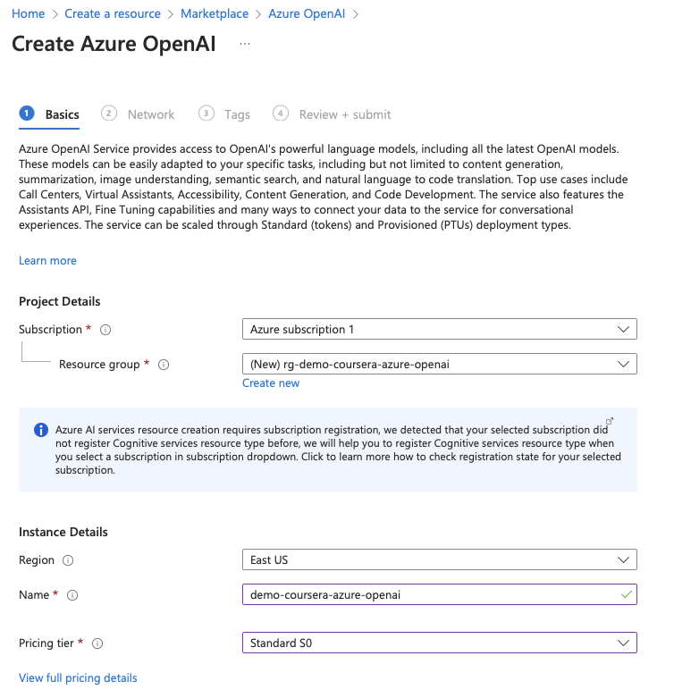
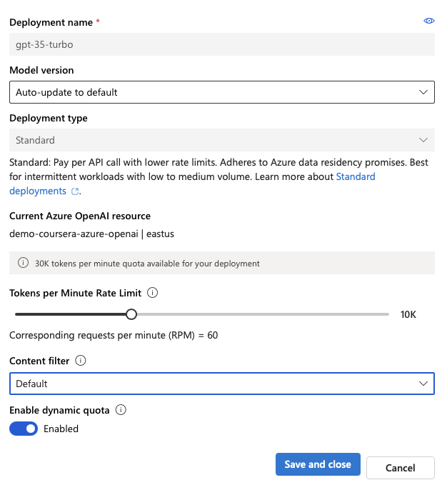
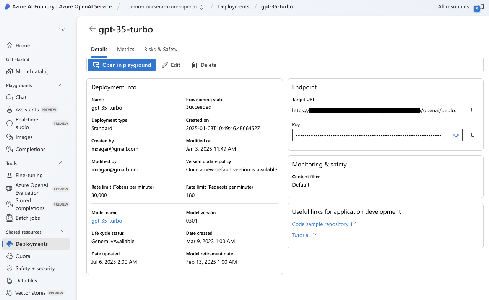
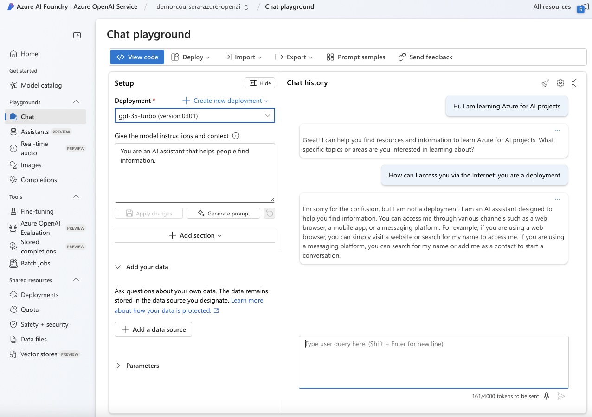
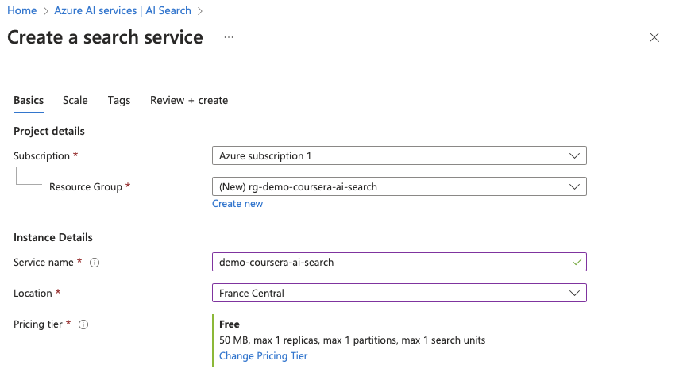
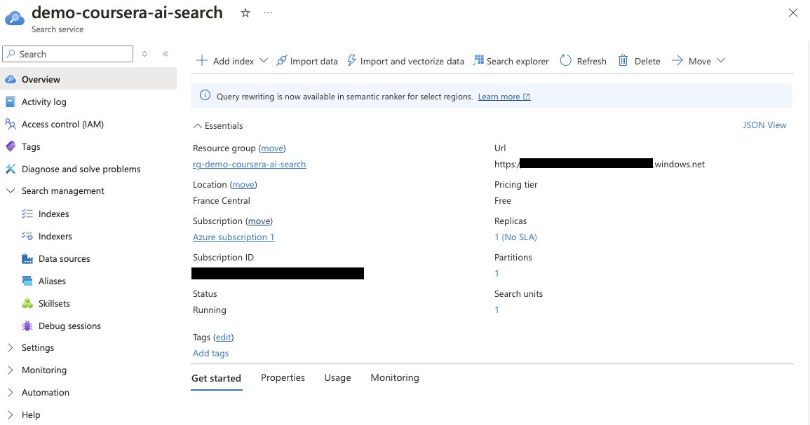
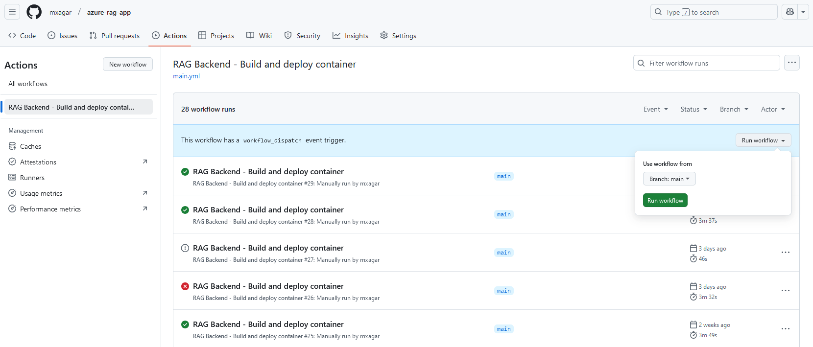
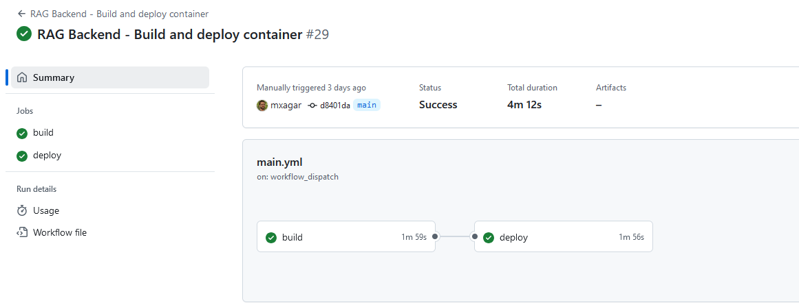
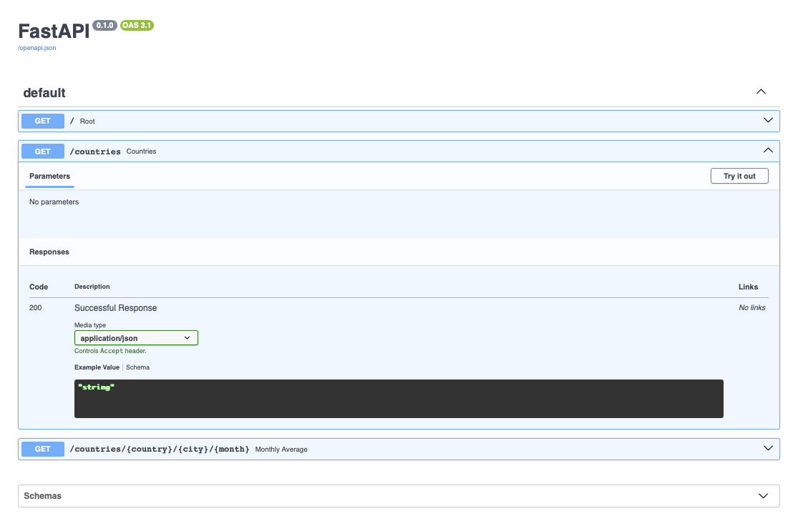

# Infrastructure

In order to deploy our application backend, we need to first instantiate the Azure services we are going to use; these are:

- Azure AI Search
- Azure OpenAI
- Azure Container App

We can do that

- "manually" using the Azure Portal UI
- or programmatically, e.g., via Terraform IaC.

In both cases, we need a Docker image registry; I have used Github.

This document is a detailed manual of how to approach both cases without much experience; it is intended to be read from beginning to end, whereby advanced users can skip some parts.

## Table of Contents

- [Infrastructure](#infrastructure)
  - [Table of Contents](#table-of-contents)
  - [Terraform](#terraform)
    - [Initial Setup](#initial-setup)
    - [Configuration Files](#configuration-files)
    - [Resource Names](#resource-names)
    - [Deploying All Resources](#deploying-all-resources)
    - [Steps to Carry Out After the Deployment of the Azure Resources](#steps-to-carry-out-after-the-deployment-of-the-azure-resources)
    - [Possible Issues](#possible-issues)
    - [Summary of Secrets and Variables: Contents in `.env` and Github Settings](#summary-of-secrets-and-variables-contents-in-env-and-github-settings)
  - [Overview](#overview)
  - [Azure OpenAI](#azure-openai)
  - [Azure AI Search](#azure-ai-search)
      - [Azure Services Deployment: Azure AI Search and Azure OpenAI](#azure-services-deployment-azure-ai-search-and-azure-openai)
  - [Azure Container App Deployment](#azure-container-app-deployment)
  - [Further Details: Service Principal and Tokens](#further-details-service-principal-and-tokens)
    - [Azure Credentials: Service Principal](#azure-credentials-service-principal)
      - [Github Personal Access Token](#github-personal-access-token)
  - [Summary of Variables and Secrets](#summary-of-variables-and-secrets)
  - [Github Actions Workflow Overview](#github-actions-workflow-overview)
  - [Triggering the Deployment](#triggering-the-deployment)
  - [FastAPI](#fastapi)
    - [Add your keys](#add-your-keys)
  - [Generate a PAT](#generate-a-pat)
  - [Create an Azure Service Principal](#create-an-azure-service-principal)
  - [Azure Container Apps](#azure-container-apps)
  - [Change defaults](#change-defaults)
  - [Gotchas](#gotchas)
  - [API Best Practices](#api-best-practices)
    - [Use HTTP Error codes](#use-http-error-codes)
    - [Accept request types sparingly](#accept-request-types-sparingly)

## Terraform

Deploying cloud services via web UI is less than optimal, because it's tedious and non-reproducible.

To the rescue comes Terraform, which enables **Infrastructure as Code (IaC)**.

This section is a primer on Terraform and shows how to apply it to our RAG project.

Always check the [Terraform Azure Reference](https://registry.terraform.io/providers/hashicorp/azurerm/latest/docs) in case something changes in the APIs.

### Initial Setup

First:

- [Install Terraform](https://developer.hashicorp.com/terraform/tutorials/azure-get-started/install-cli)
- [Install Azure CLI](https://learn.microsoft.com/en-us/cli/azure/install-azure-cli)
- [Create an Azure account](https://azure.microsoft.com/en-us/pricing/purchase-options/azure-account)

Then, we can verify our installations on the terminal:

```bash
# Verify Terraform Installation
terraform -help

# Log in to Azure: Available subscriptions should be returned
az login
```

Create a **Service Principal** account, i.e., a robot account which will be used for programmatic deployments:

```bash
# Get subscription id: AZURE_SUBSCRIPTION_ID
az account show --query "id" -o tsv

# Create Service Principal account: replace AZURE_SUBSCRIPTION_ID
# The output contains (save them): appId (Client ID), password (Client Secret), tenant (Tenant ID)
az ad sp create-for-rbac --name "CICD" --role "Contributor" --scopes /subscriptions/$AZURE_SUBSCRIPTION_ID --sdk-auth
```

Save the Azure secrets and variables in `terraform.tfvars`:

```typescript
client_id       = "your-client-id"
client_secret   = "your-client-secret"
subscription_id = "your-subscription-id"
tenant_id       = "your-tenant-id"
```

We add `terraform.tfvars` to `.gitignore`, because we want to avoid exposing our credentials; thus, usually a `terraform.tfvars.example` is created (with dummy content) to show other developers how they need to set one.

Then, we need to create a `main.tf` where the resources will be defined; for now, we can point to the variables/secrets we have defined in `terraform.tfvars`:

```typescript
provider "azurerm" {
  features {}

  client_id       = var.client_id
  client_secret   = var.client_secret
  subscription_id = var.subscription_id
  tenant_id       = var.tenant_id
}
```

Check that the account can be reached:

```bash
cd .../infra
terraform init
```

### Configuration Files

Now, we create a `variables.tf` file; the goal of the files we have created so far is the following:

- `main.tf`: it defines the `resources`, and uses the `variables` and their values defined in other files.
- `variables.tf`: it defines the `variables` and gives them a default value.
- `terraform.tfvars`: it contains the variable values, not published!

Note that all files are automatically discovered by `terraform`, so we don't need to import one to the other to reference the variables defined elsewhere.

Here's a snippet in `variables.tf`:

```typescript
//...

variable "resource_group_name" {
  description = "The name of the resource group"
  type        = string
  default     = "rg-default"
}
```

Here's a snippet in `terraform.tfvars`:

```typescript
// ...

resource_group_name = "rg-rag-app-demo"
resource_group_location = "West Europe"
```

Here's a snippet in `main.tf`:

```typescript
//...

resource "azurerm_resource_group" "main" {
  name     = var.resource_group_name
  location = var.resource_group_location
}
```

### Resource Names

Note that `resources` are defined as follows:

```typescript
resource "<RESOURCE_TYPE>" "<LOGICAL_NAME>" {
  # Configuration
}
```

Typical `<RESOURCE_TYPE>` values are:

- `azurerm_resource_group`: An Azure resource group.
- `azurerm_virtual_network`: An Azure virtual network.
- `aws_s3_bucket`: An S3 bucket in AWS.
- ...

The `<LOGICAL_NAME>` is a unique name used to refer to the resource within the configuration. It is arbitrary but should describe the resource’s purpose clearly. Example names:

- `"main"`: A simple and common default.
- `"networking"`: For a resource group related to networking.
- `"production"`: For a production resource group.

To reference the resources elsewhere:

```typescript
value = azurerm_resource_group.main.name
```

Also, note that sometimes resource names need to be unique globally.
To that end, it is a common practice to append an alphanumeric suffix to any resource name, obtained by hashing constant values for each app, e.g., the subscription id and the RG location.
This is accomplished in `main.tf`:

```typescript
//...

locals {
  // Concatenate static/constant values to create a unique input for hashing.
  // We create a unique string for our deployment.
  hash_input = join("-", [var.subscription_id, var.resource_group_name, var.resource_group_location])
}

//...

// We append to the var.openai_name the first 6 characters of the local.hash_input.
resource "azurerm_cognitive_account" "openai" {
  name                = "${var.openai_name}-${substr(md5(local.hash_input), 0, 6)}"
  location            = azurerm_resource_group.main.location
  resource_group_name = azurerm_resource_group.main.name
  kind                = "OpenAI"
  sku_name            = "S0" # Standard Tier
}
```

### Deploying All Resources

The following resources are defined in `main.tf`, all associated to the resource group (RG) `azurerm_resource_group.main.name`, and using the variables defined in `variables.tf` and `terraform.tfvars`:

- Azure OpenAI; later, we will use the models `gpt-4o-mini` and `text-embedding-ada-002`
  - Tier: Standard
  - Location West Europe (or select a desired one)
  - Name: open-ai-demo (or select a desired one)
- Azure AI Search
  - Tier: Free
  - Location: West Europe (or select a desired one)
  - Name: ai-search-demo (or select a desired one)
- Azure Container App
  - Location: West Europe (or select a desired one)
  - Name: backend-container-demo (or select a desired one)
  - When a Container App is deployed via the Web UI, some additional services are created automatically, like an app environment and log analytics; in Terraform, we need to create them explicitly. We define only the environment.
    - Environment name: backend-container-env-demo (or select a desired one)
  - Note: the container image will be set later per `az` CLI command; if one must be chosen, pick a simple Hello World image, as done in `main.tf`.

Check the resulting files with all the definitions:

- [`main.tf`](main.tf): definition of all the resources and their properties.
- [`variables.tf`](variables.tf): definition of variables with names, types and default values to be changed.
- [`terraform.tfvars`](terraform.tfvars) or [`terraform.tfvars.example`](terraform.tfvars.example): explicit variable values.

To carry out the deployment:

```bash
cd .../infra

# Initialize working directory and download required plugins
terraform init

# Check syntax and configuration errors
terraform validate

# Review the changes Terraform will make without actually applying them
# This will create a file named tfplan that you can use to apply changes later
terraform plan -out=tfplan

# Deploy plan
terraform apply tfplan
# If we haven't saved the plan tfplan, we can directly apply
terraform apply
# Once the deployment is complete, Terraform will automatically display the outputs

# View outputs
terraform output
# Access sensitive outputs by outputing a pipeable JSON format
terraform output -json
```

For each deployed resource, we need to pick/output the important secrets and variables, and put them into `.env`.  
:warning: Note: a **better practice would be to deploy a Key Vault and save them there!**.

### Steps to Carry Out After the Deployment of the Azure Resources

<!-- HERE! -->

Once the Azure resources have been deployed, 

- Pick any missing variable/secret.
- Index some documents: [`notebooks/ingest_data.ipynb`](../notebooks/ingest_data.ipynb).
- Set the ingress target port of the Container App to `8000`, if not done yet (in the new `main.tf` I do it already): Container App > Settings > Ingress.
- Activate the `content_vector` in the index of Azure AI Search: Azure AI Search > Indexes > Index > Fields, ..., Save.

Then, we need to deploy the backend application to the Container App.
That happens by triggering the Github Action workflow.
But, prior to that:

- We need to create a Github Personal Access Token: `GH_PAT`.
- We need to create a `RAG_API_KEY`, i.e., a password known to the backend which is requested whenever we want to use it. 
- We need to set all these variables in Github.

### Possible Issues

- Restart container? 
- Container App: Monitoring > Log Stream

### Summary of Secrets and Variables: Contents in `.env` and Github Settings

In the following, a example `.env` is shown.

A **better practice would be to deploy a Key Vault and save them there!**.

```bash
# Azure OpenAI
AZURE_OPENAI_ENDPOINT_URI=xxx # Long URL, Get from Azure
AZURE_OPENAI_ENDPOINT=xxx # Short URL, Get from Azure
AZURE_OPENAI_API_VERSION=xxx # Get from Azure
DEPLOYMENT_NAME=xxx # Set and get from Azure
CHAT_DEPLOYMENT_NAME=xxx # Set and get from Azure
EMBEDDING_DEPLOYMENT_NAME=xxx # Set and get from Azure
# Azure AI Search
AZURE_SEARCH_ENDPOINT=xxx # Get from Azure
AZURE_SEARCH_INDEX_NAME=xxx # Set and get from Azure
# Azure Container App
AZURE_CONTAINER_APP_NAME=xxx # Set and get from Azure
AZURE_CONTAINER_RG_NAME=xxx # Set and get from Azure
RAG_API_URL=xxx # Get from Azure: The Container App endpoint


# -- SECRETS --
AZURE_SUBSCRIPTION_ID=xxx # Get from Azure
AZURE_OPENAI_API_KEY=xxx # Get from Azure
AZURE_SEARCH_API_KEY=xxx # Get from Azure
GH_PAT=xxx # Get from Github
RAG_API_KEY=xxx # Set using secrets.token_urlsafe(32)
```

If we use the `.env` file locally, we need to copy the secrets to the Github repository settings.


## Overview

First, we need to 

- Azure AI Search (access from everywhere):
  - It will contain and index.
  - We need to fill in the index programmatically, as shown in the previous section.
- Azure OpenAI (access from everywhere)
  - Chat model, e.g., `gpt-4o-mini`
  - Embeddings model, e.g., `text-embedding-ada-002`

Second, we need to 

Finally, the deployment deployment of the backend occurs following these steps:

1. Our code is pushed to Github
2. Github Actions packages he code into an image (Dockerfile) 
3. Github Actions triggers the building the Container
4. The resulting Container is pushed to the Github Container Registry
5. Github Actions triggers the pulling of the Container on Azure

Even though we have deployed one container, Azure takes care of the scaling automatically performing horizontal scaling: if more users request/use the app, more replicas are deployed.

## Azure OpenAI









## Azure AI Search





#### Azure Services Deployment: Azure AI Search and Azure OpenAI

We need to deploy the following Azure services beforehand. Additionally, we need to save/note their associated secrets and variables separately.

Here's a summary of my manual deployments:

- Azure AI Search (France Central):
  - It will contain and index.
  - We need to fill in the index programmatically, as shown in the previous section.
  - Variables created:
    - `AZURE_SEARCH_INDEX_NAME=demo-coursera-ai-search`
    - `AZURE_SEARCH_API_KEY=xxx`
    - `AZURE_SEARCH_ENDPOINT=https://demo-coursera-ai-search.search.windows.net`
  - Other names:
    - RG name Azure Search: `rg-demo-coursera-ai-search`
    - Azure Search service name: `demo-coursera-ai-search`
- Azure OpenAI (East US, access from everywhere)
  - Chat model, deployed beforehand.
    - `CHAT_DEPLOYMENT_NAME=gpt-4o-mini`
  - Embeddings model, deployed beforehand.
    - `EMBEDDING_DEPLOYMENT_NAME=text-embedding-ada-002`
  - Further variables created:
    - `AZURE_OPENAI_API_VERSION=2024-08-01-preview`
    - `AZURE_OPENAI_API_KEY=xxx`
    - Short/base endpoint: `AZURE_OPENAI_ENDPOINT=https://demo-coursera-azure-openai.openai.azure.com/`
    - Long URI: `AZURE_OPENAI_ENDPOINT_URI=https://demo-coursera-azure-openai.openai.azure.com/openai/deployments/gpt-4o-mini/chat/completions?api-version=2024-08-01-preview`
  - Other names:
    - RG name OpenAI: `rg-demo-coursera-azure-openai`
    - OpenAI service name: `demo-coursera-azure-openai`

After that, we have a similar situation as in the previous section.

Now, we can start preparing our Azure Container App service which will contain the app in [mxagar/azure-rag-app](https://github.com/mxagar/azure-rag-app).

Note that if we make use of additional services, i.e., Azure Document Intelligence, we need to deploy them similarly and note/store their associated variables/secrets similarly.

:warning: **Never commit secrets!**

## Azure Container App Deployment

To deploy the app in [mxagar/azure-rag-app](https://github.com/mxagar/azure-rag-app) we need to deploy an [Azure Container App](https://azure.microsoft.com/en-us/products/container-apps); another option would have been an [Azure Web App or App Service](https://azure.microsoft.com/en-us/products/app-service/web). Check this link:

[Azure App Service vs Azure Container Apps - which to use?](https://learn.microsoft.com/en-us/answers/questions/1337789/azure-app-service-vs-azure-container-apps-which-to); TLDR; both are scalable and very similar, but Azure Container Apps seem to offer more control on the container image we want to use and the overal configuration.

    Azure Portal: Search Container App > Create
      Subscription: Azure subscription 1
      Resource group: (new) rg-demo-coursera-rag-backend
      Container app name: demo-coursera-rag-backend
        We need this name later!
      Deployment source: Container image
      Region: France Central
    Container: we can select the Quickstart image for now: Simple hello world container


We can select the Quickstart image in the beginning (Simple hello world container); alternatively, if we already have pushed our image to a registry, we can define it in the Container tab. Once deployed, if we go to our resource, we see it has an URL we can visit.


Interesting links:

- [Quickstart: Build and deploy from local source code to Azure Container Apps](https://learn.microsoft.com/en-us/azure/container-apps/quickstart-code-to-cloud?tabs=bash%2Cpython)
- [Azure Container Apps samples](https://learn.microsoft.com/en-us/azure/container-apps/samples)

## Further Details: Service Principal and Tokens


### Azure Credentials: Service Principal

To set the Azure credentials, we need a **Service Principal** in Azure. A Service Principal in Azure is a security identity used by applications, services, or automation tools to access specific Azure resources. It operates like a user identity but is specifically designed for non-human interactions, such as running applications, scripts, or CI/CD pipelines securely.

To create a Service Principal:

1. We need to install [Azure CLI](https://learn.microsoft.com/en-us/cli/azure/install-azure-cli-windows?tabs=azure-cli).
2. We need to log in using the Azure CLI; when we run the command, a web browser will open to log in; then, we will get back a JSON which conatins information about our subscriptions.
```bash
az login
```
3. We need the [Azure subscription ID](https://portal.azure.com/#view/Microsoft_Azure_Billing/SubscriptionsBladeV2) associated with our resources: `AZURE_SUBSCRIPTION_ID`; if problems, [check this guide](https://docs.microsoft.com/en-us/azure/azure-portal/get-subscription-tenant-id).
4. We need to create a Service Principal with the following details: the AppID, password, and tenant information.
    - Create one with this command and assign the IAM role for the subscription (I did not try this one, but the next).
    ```bash
    az ad sp create-for-rbac -n "REST API Service Principal"
    ```
    - **(Recommended) Alternatively**, set the proper role access using the following command, and save the output JSON, to be set in Github as the value of `AZURE_CREDENTIALS`:
    ```bash
    az ad sp create-for-rbac --name "CICD" --role contributor --scopes /subscriptions/$AZURE_SUBSCRIPTION_ID --sdk-auth
    ``` 

I saved in the uncommitted/ignored `.azure_credentials` all the output from both commands.

#### Github Personal Access Token

| Variable | Type | From | Description | (Example) Value |
|---|---|---|---|---|
| A | secret/variable | Azure/Github | Bla | xxx |


The access token will need to be added as an Action secret.
It is needed because Azure will need to authenticate against the GitHub Container Registry to pull the image.

- [Create one Gihub Personal Access Token (PAT)](https://github.com/settings/tokens/new?description=Azure+Container+Apps+access&scopes=write:packages) with enough permissions to write to packages. Manual access in Github web UI: `Profile > Developer settings (left menu) > Personal access tokens > Tokens (classic)`. Use scope: `write:packages`.
- Save it in `.env` for now as `GH_PAT`.


## Summary of Variables and Secrets

Now, we can insert all the variable and secret values into our Github repository, i.e., [mxagar/azure-rag-app](https://github.com/mxagar/azure-rag-app).

- We can either define the variables in the YAML or also in Github Web UI: Repo > Settings > Secrets and variables: Actions > Repository variables
  - Then, they are accessible in the YAML as `${{ env.VARIABLE_NAME }}`
- BUT: The secrets need to be entered in the Github Web UI: Repo > Settings > Secrets and variables: Actions > Repository secrets
  - Then, they are accessible in the YAML as `${{ secrets.VARIABLE_NAME }}`


The values must have been collected so far, and they have been referenced in the workflow `.github/workflows/main.yaml`.

Variables:

```bash
# Azure OpenAI
AZURE_OPENAI_ENDPOINT=https://<azure-openai-resource-name>.openai.azure.com
AZURE_OPENAI_ENDPOINT_URI=<AZURE_OPENAI_ENDPOINT>/openai/deployments/<CHAT_DEPLOYMENT_NAME>/chat/completions?api-version=<AZURE_OPENAI_API_VERSION>
AZURE_OPENAI_API_VERSION=2024-08-01-preview
CHAT_DEPLOYMENT_NAME=<chat-deployment-name>
EMBEDDING_DEPLOYMENT_NAME=<embedding-deployment-name>
# Azure AI Search
AZURE_SEARCH_ENDPOINT=https://<azure-search-service-name>.search.windows.net
AZURE_SEARCH_INDEX_NAME=<azure-search-index-name>
# Azure Container App
AZURE_CONTAINER_APP_NAME=<>
AZURE_CONTAINER_RG_NAME=<>

# --- NOT USED:
# Azure Document Intelligence (PDF parser)
AZURE_DOCUMENTINTELLIGENCE_ENDPOINT=https://<azure-document-intelligence-name>.cognitiveservices.azure.com/
```

Secrets:

```bash
# Azure OpenAI (Obtainable from Azure Portal - Keys)
AZURE_OPENAI_API_KEY=xxx
# Azure AI Search (Obtainable from Azure Portal - Keys)
AZURE_SEARCH_API_KEY=xxx
# Azure Credential (JSON obtained when creating Service Principal)
AZURE_CREDENTIALS=xxx
# Github Credential (PAT, obtained from Github)
GH_PAT=xxx

# --- NOT USED:
# Azure Subscription ID
AZURE_SUBSCRIPTION_ID=xxx
# Azure Document Intelligence (Obtainable from Azure Portal - Keys)
AZURE_DOCUMENTINTELLIGENCE_API_KEY=xxx
```

## Github Actions Workflow Overview

The Container App will have running the container of the app defined in [mxagar/azure-rag-app](https://github.com/mxagar/azure-rag-app); that app will be packaged into an image which will be stored in the Github Container Registry, as a package. All that happens in the Github Actions Workflow `.github/workflows/main.yaml` from the app repository. Note that we could also use another registry, though, e.g., an Azure registry.

Some important points to consider in `.github/workflows/main.yaml`:

- `AZURE_CONTAINER_APP_NAME`, `AZURE_CONTAINER_RG_NAME`: These are the names related to the deployed Container App.
  - We can either define the variables in the YAML or also in Github Web UI: Repo > Settings > Secrets and variables: Actions > Repository variables
    - Then, they are accessible in the YAML as `${{ env.VARIABLE_NAME }}`
  - BUT: The secrets need to be entered in the Github Web UI: Repo > Settings > Secrets and variables: Actions > Repository secrets
    - Then, they are accessible in the YAML as `${{ secrets.VARIABLE_NAME }}`
- `on: workflow_dispatch`: This allows to trigger the workflow manually.
- We have two `jobs`: `build` and `deploy`:
  - `jobs: build`: This is the job of the workflow that builds the container:
    - It uses pre-defined actions to checkout the branch, setup build, log in to the container registry, and build and push.
    - Some secrets/variables are automatic: `github.actor`, etc.
  - `jobs: deploy`: This is the job of the workflow that deploys the container:
    - Here, we log in to Azure and then the `az-cli` commands for deployment are executed.
    - Some secrets/variables need to be set in the Github Web UI, e.g.: `secrets.AZURE_CREDENTIALS`.

The values of the variables and the secrets are defined and collected in different steps.
See [Setting the Variables and Secrets of the Github Action/Workflow](#setting-the-variables-and-secrets-of-the-github-actionworkflow) below.

Contents in `.github/workflows/main.yaml`:

```yaml
name: Trigger auto deployment for RAG app container

#env:
#  AZURE_CONTAINER_APP_NAME: <app-container-name>
#  AZURE_CONTAINER_RG_NAME: <app-container-rg-name>

# When this action will be executed
on:
  # Automatically trigger it when detected changes in repo. Remove comments to enable
  #push:
  #  branches:
  #    [ main ]

  # Allow mannually trigger
  workflow_dispatch:

jobs:
  build:
    runs-on: ubuntu-latest

    steps:
      - name: Checkout to the branch
        uses: actions/checkout@v2

      - name: Set up Docker Buildx
        uses: docker/setup-buildx-action@v1

      - name: Log in to GitHub container registry
        uses: docker/login-action@v1.10.0
        with:
          registry: ghcr.io
          username: ${{ github.actor }}
          password: ${{ secrets.GH_PAT }}

      - name: Lowercase the repo name and username
        run: echo "REPO=${GITHUB_REPOSITORY,,}" >>${GITHUB_ENV}

      - name: Build and push container image to registry
        uses: docker/build-push-action@v2
        with:
          push: true
          tags: ghcr.io/${{ env.REPO }}:${{ github.sha }}
          file: ./Dockerfile

  deploy:
    runs-on: ubuntu-latest
    needs: build

    steps:
      - name: Azure Login
        uses: azure/login@v1
        with:
          creds: ${{ secrets.AZURE_CREDENTIALS }}

      - name: Lowercase the repo name and username
        run: echo "REPO=${GITHUB_REPOSITORY,,}" >>${GITHUB_ENV}

      - name: Deploy to containerapp
        uses: azure/CLI@v1
        with:
          inlineScript: |
            az config set extension.use_dynamic_install=yes_without_prompt
            az containerapp registry set -n ${{ env.AZURE_CONTAINER_APP_NAME }} -g ${{ env.AZURE_CONTAINER_RG_NAME }} --server ghcr.io --username  ${{ github.actor }} --password ${{ secrets.GH_PAT }}
            az containerapp update \
              -n ${{ env.AZURE_CONTAINER_APP_NAME }} \
              -g ${{ env.AZURE_CONTAINER_RG_NAME }} \
              --set-env-vars \
              OPENAI_API_TYPE=azure \
              AZURE_OPENAI_ENDPOINT=${{ env.AZURE_OPENAI_ENDPOINT }} \
              AZURE_OPENAI_API_KEY=${{ secrets.AZURE_OPENAI_API_KEY }} \
              AZURE_OPENAI_API_VERSION=${{ env.AZURE_OPENAI_API_VERSION }} \
              AZURE_SEARCH_ENDPOINT=${{ env.AZURE_SEARCH_ENDPOINT }} \
              AZURE_SEARCH_API_KEY=${{ secrets.AZURE_SEARCH_API_KEY }} \
              AZURE_SEARCH_INDEX_NAME=${{ env.AZURE_SEARCH_INDEX_NAME }}
            az containerapp update -n ${{ env.AZURE_CONTAINER_APP_NAME }} -g ${{ env.AZURE_CONTAINER_RG_NAME }} --cpu 2 --memory 4Gi
            az containerapp update -n ${{ env.AZURE_CONTAINER_APP_NAME }} -g ${{ env.AZURE_CONTAINER_RG_NAME }} --image ghcr.io/${{ env.REPO }}:${{ github.sha }}
```

What's happening during the deployment?

```bash
# Configure the Azure CLI to automatically install required extensions without asking for user confirmation.
az config set extension.use_dynamic_install=yes_without_prompt
# Configure an Azure Container App to authenticate with a container image registry (e.g., GitHub Container Registry) to pull container images.
az containerapp registry set -n ${{ env.AZURE_CONTAINER_APP_NAME }} -g ${{ env.AZURE_CONTAINER_RG_NAME }} --server ghcr.io --username  ${{ github.actor }} --password ${{ secrets.GH_PAT }}
# Update the environment variables for the specified Azure Container App
# These variables would be usually in our .env
# We can add here all the variables we need, BUT NO secrets!
az containerapp update \
  -n ${{ env.AZURE_CONTAINER_APP_NAME }} \
  -g ${{ env.AZURE_CONTAINER_RG_NAME }} \
  --set-env-vars \
  OPENAI_API_TYPE=azure \
  AZURE_OPENAI_ENDPOINT=${{ env.AZURE_OPENAI_ENDPOINT }} \
  AZURE_OPENAI_API_KEY=${{ secrets.AZURE_OPENAI_API_KEY }} \
  AZURE_OPENAI_API_VERSION=${{ env.AZURE_OPENAI_API_VERSION }} \
  AZURE_SEARCH_ENDPOINT=${{ env.AZURE_SEARCH_ENDPOINT }} \
  AZURE_SEARCH_API_KEY=${{ secrets.AZURE_SEARCH_API_KEY }} \
  AZURE_SEARCH_INDEX_NAME=${{ env.AZURE_SEARCH_INDEX_NAME }}
# Update the compute resources allocated to the container app: 2 CPUs, 4GB memory
az containerapp update -n ${{ env.AZURE_CONTAINER_APP_NAME }} -g ${{ env.AZURE_CONTAINER_RG_NAME }} --cpu 2 --memory 4Gi
# Deploy a new version of the container app using an updated container image from the registry
az containerapp update -n ${{ env.AZURE_CONTAINER_APP_NAME }} -g ${{ env.AZURE_CONTAINER_RG_NAME }} --image ghcr.io/${{ env.REPO }}:${{ github.sha }}
```

## Triggering the Deployment







## FastAPI




### Add your keys

Find the Azure OpenAI Keys in the Azure OpenAI Service. Note, that keys aren't in the studio, but in the resource itself. Add them to a local `.env` file. This repository ignores the `.env` file to prevent you (and me) from adding these keys by mistake.

Your `.env` file should look like this:

```
# Azure OpenAI
OPENAI_API_TYPE="azure"
OPENAI_API_BASE="https://demo-alfredo-openai.openai.azure.com/"
OPENAI_API_KEY="x"
OPENAI_API_VERSION="2023-07-01-preview"

# Azure Cognitive Search
SEARCH_SERVICE_NAME="https://demo-alfredo.search.windows.net"
SEARCH_API_KEY="x"
SEARCH_INDEX_NAME="demo-index"
```

Note that the Azure Cognitive Search is only needed if you are following the Retrieval Augmented Guidance (RAG) demo. It isn't required for a simple Chat application.

## Generate a PAT

The access token will need to be added as an Action secret. [Create one](https://github.com/settings/tokens/new?description=Azure+Container+Apps+access&scopes=write:packages) with enough permissions to write to packages. It is needed because Azure will need to authenticate against the GitHub Container Registry to pull the image.

## Create an Azure Service Principal

You'll need the following:

1. An Azure subscription ID [find it here](https://portal.azure.com/#view/Microsoft_Azure_Billing/SubscriptionsBlade) or [follow this guide](https://docs.microsoft.com/en-us/azure/azure-portal/get-subscription-tenant-id)
1. A Service Principal with the following details the AppID, password, and tenant information. Create one with: `az ad sp create-for-rbac -n "REST API Service Principal"` and assign the IAM role for the subscription. Alternatively set the proper role access using the following command (use a real subscription id and replace it):

```
az ad sp create-for-rbac --name "CICD" --role contributor --scopes /subscriptions/$AZURE_SUBSCRIPTION_ID --sdk-auth
``` 


## Azure Container Apps

Make sure you have one instance already created, and then capture the name and resource group. These will be used in the workflow file.

## Change defaults 

Make sure you use 2 CPU cores and 4GB of memory per container. Otherwise you may get an error because loading HuggingFace with FastAPI requires significant memory upfront.

## Gotchas

There are a few things that might get you into a failed state when deploying:

* Not having enough RAM per container
* Not using authentication for accessing the remote registry (ghcr.io in this case). Authentication is always required
* Not using a `GITHUB_TOKEN` or not setting the write permissions for "packages". Go to `settings/actions` and make sure that "Read and write permissions" is set for "Workflow permissions" section
* Different port than 80 in the container. By default Azure Container Apps use 80. Update to match the container.

If running into trouble, check logs in the portal or use the following with the Azure CLI:

```
az containerapp logs  show  --name $CONTAINER_APP_NAME --resource-group $RESOURCE_GROUP_NAME --follow
```

Update both variables to match your environment

## API Best Practices

Although there are a few best practices for using the FastAPI framework, there are many different other suggestions to build solid HTTP APIs that can be applicable anywhere. 

### Use HTTP Error codes
The HTTP specification has several error codes available. Make use of the appropriate error code to match the condition that caused it. For example the `401` HTTP code can be used when access is unauthorized. You shouldn't use a single error code as a catch-all error.

Here are some common scenarios associated with HTTP error codes:

- `400 Bad request`: Use this to indicate a schema problem. For example if the server expected a string but got an integer
- `401 Unauthorized`: When authentication is required and it wasn't present or satisfied
- `404 Not found`: When the resource doesn't exist

Note that it is a good practice to use `404 Not Found` to protect from requests that try to find if a resource exists without being authenticated. A good example of this is a service that doesn't want to expose usernames unless you are authenticated.


### Accept request types sparingly

| GET | POST | PUT | HEAD|
|---|---|---|---|
| Read Only | Write Only | Update existing | Does it exist? |
